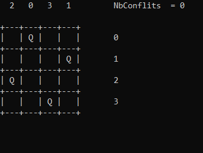
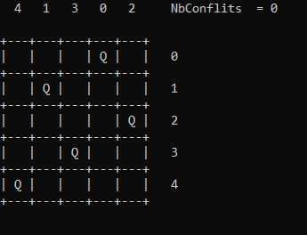
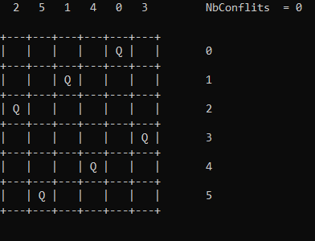
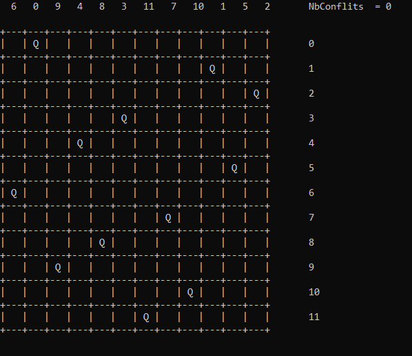

# Problème des N Reines avec un algorithme génétique

Ce projet vise à résoudre le problème classique des N reines en utilisant un algorithme génétique implémenté en C++. Le problème des N reines consiste à placer N reines sur un échiquier de N x N de manière à ce qu'aucune reine ne puisse menacer une autre reine en une seule étape de mouvement. L'algorithme génétique sera utilisé pour trouver une disposition optimale des reines. (https://en.wikipedia.org/wiki/Eight_queens_puzzle)

## Fonctionnalités clés

- **Représentation génétique :** Les individus de la population seront représentés sous forme de séquences génétiques correspondant aux positions des reines.
- **Opérations génétiques :** L'algorithme génétique mettra en œuvre des opérations telles que la sélection, le croisement et la mutation pour évoluer la population vers une solution optimale.
- **Fonction d'évaluation :** Une fonction d'évaluation sera définie pour évaluer la qualité de chaque disposition de reines.

---

4 reines :  

 

5 reines :  

 

6 reines :  

 

12 reines :  

